# Data Modeling

## Contents

- [Selecting NetCDFs](#selecting-netCDFs)
- [Building a Graph](#building-a-graph)
- [Nodes](#nodes)
  - [Load Node](#load-node)
  - [Threshold Node](#threshold-node)
  - [Join Node](#join-node)
  - [Filter By Country Node](#filter-by-country-node)
  - [Reduce By Node](#reduce-by-node)
  - [Save Node](#save-node)
- [Manual Resolution](#manual-resolution)
- [Processing](#processing)

## Introduction

With Dojo's Data Modeling tool, users can combine NetCDF datasets together through a simple visual programming interface to create new and insightful derived datasets.

Relatively complex data operations and transformations can be performed on a variety of different kinds of data, no programming skills required.

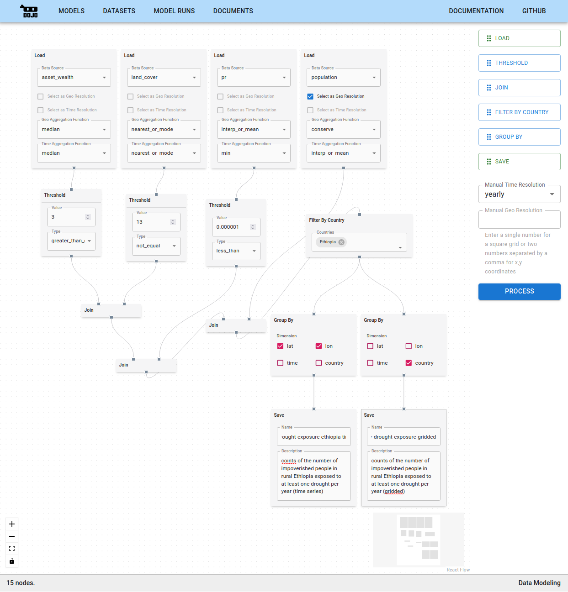

## Selecting NetCDFs

When you initially land on the Data Modeling page, you'll be prompted to selected registered NetCDFs. If you have a NetCDF that you'd like to use that isn't yet registered in Dojo, follow the steps in [Data Registration](./data-registration) to register it. It will then appear in the list of NetCDF datasets.

You can select as many datasets as you'd like. Once you've selected all your datasets, click `USE THESE DATASETS` on the bottom of the page to move to the next step.

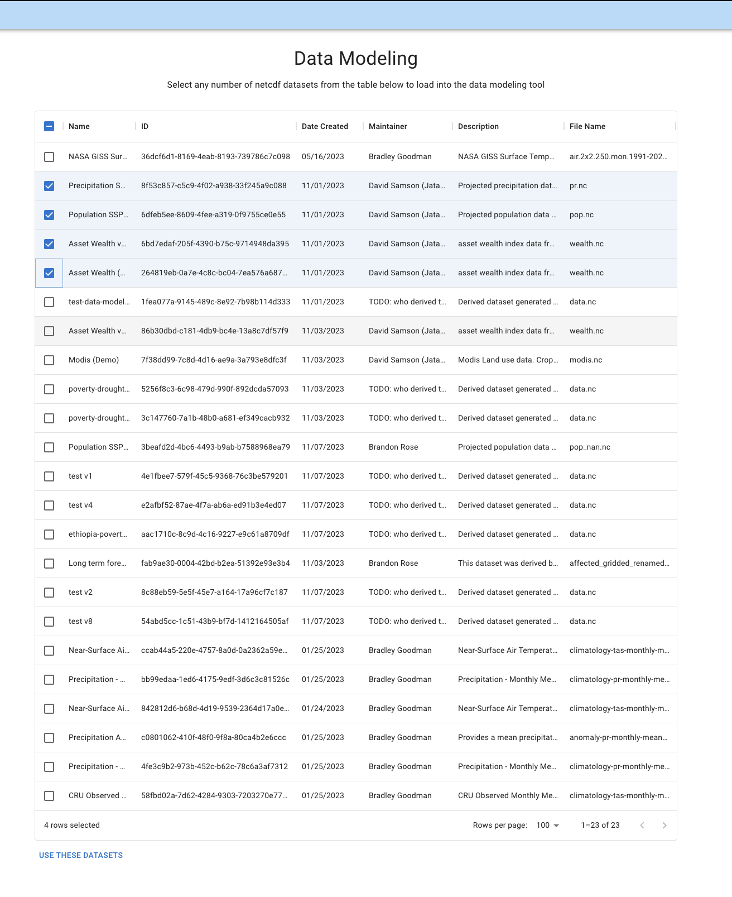

## Building a Graph

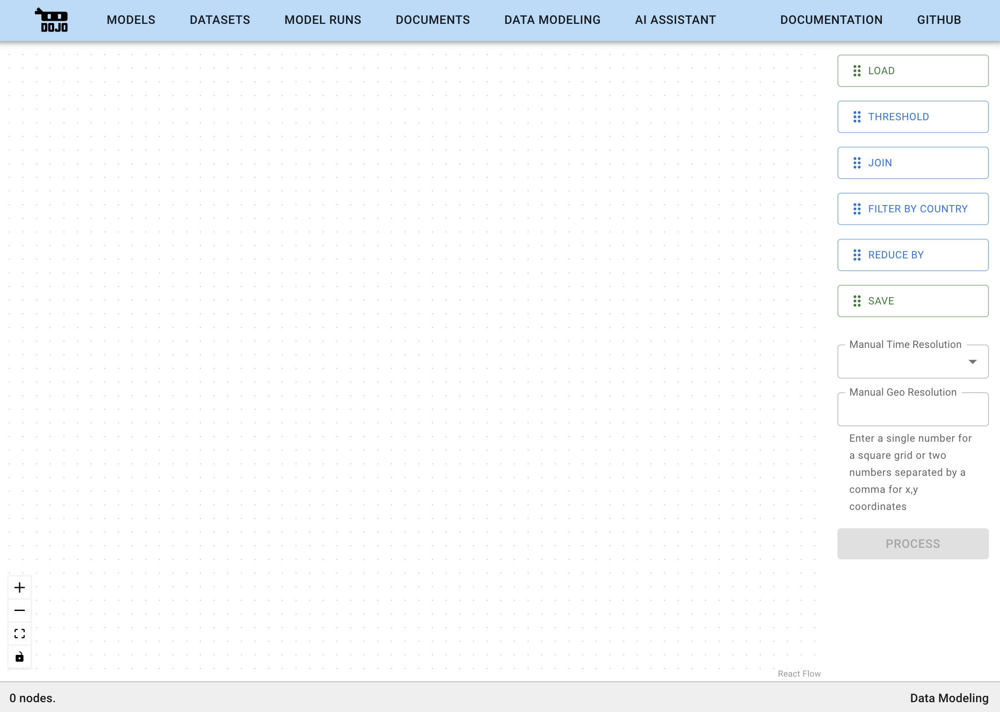

On the second step, you can start building out your data graph. Drag and drop nodes (explained in further detail below) from the node selection panel on the right side of the screen onto the blank canvas area on the left. Once nodes are on the canvas, they will appear with small connection points on the top and/or bottom (inputs and outputs respectively). You can click and drag between these connection points to apply operations to the data.

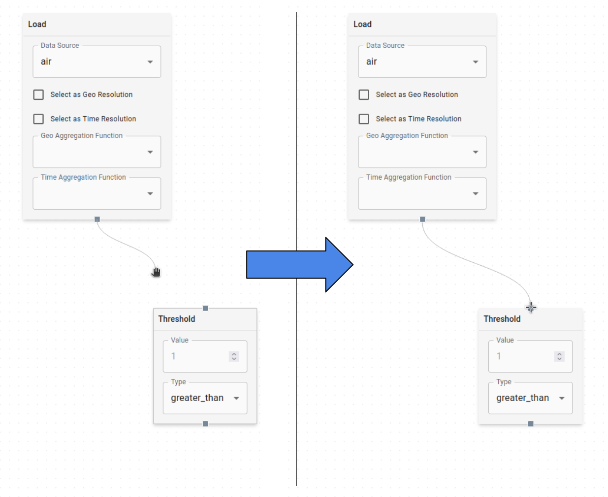

Adding multiple nodes and creating a network of connections between them defines how input data should be transformed by the data flow graph to create the derived output data.

## Nodes:

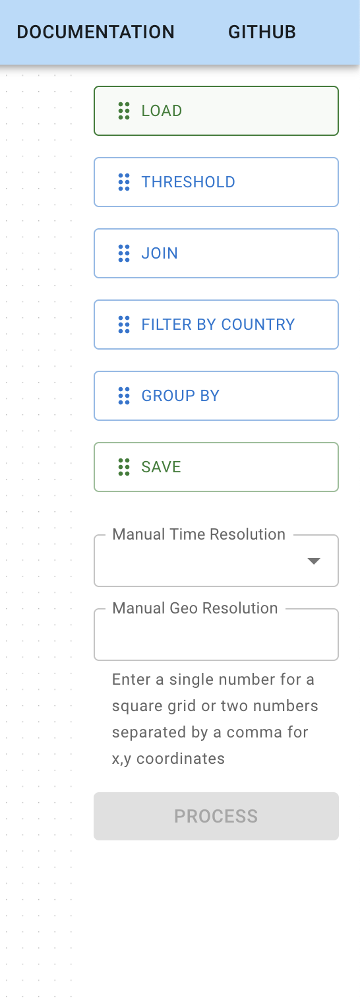

### Load Node

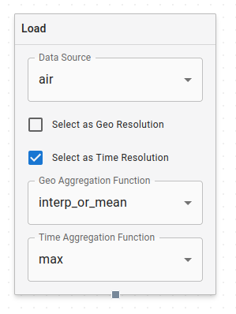

The Load Node is how data is brought into the data modeling process. Each Load Node represents **one** feature from a dataset. You select this feature with the `Data Source` dropdown at the top of the node. You'll see features listed per dataset in this dropdown.

The following options in the Load Node relate to how data regridding is handled.

The first of these is a global target resolution that applies to all your features. You need to select both a geo and temporal target resolution. You can either manually hardcode these (see [Manual Resolution](#manual-resolution) below), or you can check one or both of the boxes on a Load Node to make its resolution be the target resolution. For the entire graph, you can only have one geo and one temporal target resolution, either in the Load Nodes or in the manual selectors in the sidebar.

The second is selecting regridding methods that will be used if the data in the load node needs to be regridded. These are specified with the Geo and Time Aggregation function dropdowns for each Load Node:
- `conserve` - maintain the total sum of the data before and after (e.g. for regridding population)
- `min` - take the minimum value from each bucket during regridding
- `max` - take the maximum value from each bucket during regridding
- `mean` - take the mean value from each bucket during regridding. *Note: Use interp_or_mean instead of `mean`, since it doesn't handle well when increasing the resolution of the data*
- `median` - take the median value from each bucket during regridding
- `mode`  - take the mode of each bucket during regridding. *Note: Use nearest_or_mode instead of `mode`, since it doesn't handle well when increasing the resolution of the data*
- `interp_or_mean`  - if increasing resolution, interpolate the data. If decreasing resolution, take the mean of each bucket
- `nearest_or_mode`  - if increasing resolution, take the nearest data. if decreasing resolution, take the mode of each bucket

### Threshold Node
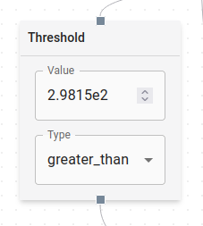

Threshold Nodes are used to select specific portions of data where some condition is true.

Take the example of a temperature dataset where you want to filter for values above a threshold temperature. A Threshold Node that takes temperature data as input and is set to `greater_than` with the value of your threshold creates a boolean mask that is true wherever the condition was met. This can then be used to filter the original data with a [Join Node](#join-node).

Threshold values can be an integer or floating point number. The type of comparison operation (`=`, `≠`, `>`, `≥`, `<`, `≤`)  is specified with the dropdown menu.

### Join Node
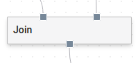

Join Nodes are used to combine multiple nodes in the graph into a single dataset. Join Nodes take as input two parent nodes and output the values of those input nodes combined together. Under the hood, a Join Node multiplies the input datasets together.

The most common use case for Join Nodes is to filter data to where some condition is true. A dataset mask can be created with a [Threshold Node](#threshold-node), and then that mask can be "joined" with the data that you want to apply the mask to.

Less commonly, depending on the particular data operations you are trying to do, it may make sense to use a Join Node to multiply two separate datasets together to get a new dataset out the other end. For example, if one dataset is gridded solar energy flux (watts/meter^2), and another dataset is solar panel area (meter^2) per each lat/lon point, you could multiply them together with a Join Node to get a new dataset that is the expected power production per each lat/lon grid point.

### Filter By Country Node
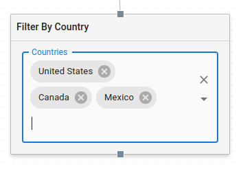

With this node, you can filter the data coming out of your selected features by the countries you select in the dropdown. You can select multiple countries. The output dataset will be a copy of the input dataset, but with an extra `admin0` (i.e. country) dimension. Every country specified in the Filter By Country Node will be split into its own separate layer along the country dimension of the output. All other values not within the bounds of any of the specified countries will be set to `0`

### Reduce By Node
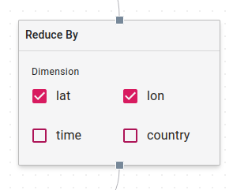

This node can be used to aggregate a dataset across one or more dimensions. The input dataset will be `sum-reduced` along the dimensions specified by the checkboxes. For example, say you have monthly population data gridded to `0.1x0.1` lat/lon, and you would like to produce a single population curve over time. Using the Reduce By Node, selecting `lat` and `lon` will sum up all of the values for each time slice in the input dataset, and produce a new dataset that is just a single aggregated curve over time.

> Note: at present, Reduce By Nodes are hardcoded with the options `lat`, `lon`, `time`, and `country`, regardless of what dimensions your data has. Take care to only select dimensions that already exist on your dataset.

### Save Node
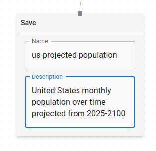

The final step in a graph is adding a Save Node. The Save Node has input text fields for both name and description, which will be used to label the output dataset and save it back into Dojo as a new derived dataset.

## Manual Resolution
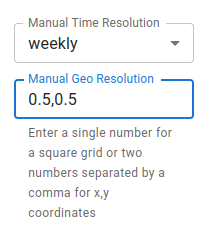

Below the list of nodes on the right side of the screen, you'll find two inputs where you can manually set your Geo and/or Time Resolution. You can use these instead of selecting one of your `Load Node` features to be Geo/Time Resolution if you want to set the resolution by hand. If you set it here, you won't be able to select any of the same type of resolution elsewhere until you clear it.

> Note: Selecting both a Geo and a Temporal Resolution is required before you can [process](#processing) your graph. These can be set manually in the sidebar, in the Load Nodes, or one of each.

## Processing
Once you're done setting up your graph, click the `PROCESS` button to start running the backend process. When it's complete, you'll see a list of the datasets that the process output. 

> Note: It is important to make sure you have at least one Load Node with a feature selected. Also ensure that all the nodes in your graph are connected before hitting process.