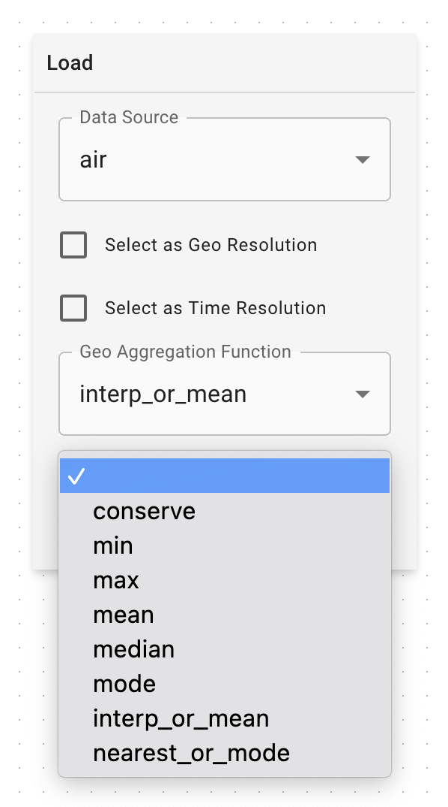

# Aggregation Methods for Data Modeling

In the Data Modeling [Load Nodes](../data-modeling#load-node), regridding methods need to be selected if the data is going to be geographically and/or temporally regridded. This is the list of options available in both the Geo and Time Aggregation dropdowns:

- `conserve` - maintain the total sum of the data before and after (e.g. for regridding population)
- `min` - take the minimum value from each bucket during regridding
- `max` - take the maximum value from each bucket during regridding
- `mean` - take the mean value from each bucket during regridding. *Note: Use interp_or_mean instead of `mean`, since it doesn't handle well when increasing the resolution of the data*
- `median` - take the median value from each bucket during regridding
- `mode`  - take the mode of each bucket during regridding. *Note: Use nearest_or_mode instead of `mode`, since it doesn't handle well when increasing the resolution of the data*
- `interp_or_mean`  - if increasing resolution, interpolate the data. If decreasing resolution, take the mean of each bucket
- `nearest_or_mode`  - if increasing resolution, take the nearest data. if decreasing resolution, take the mode of each bucket