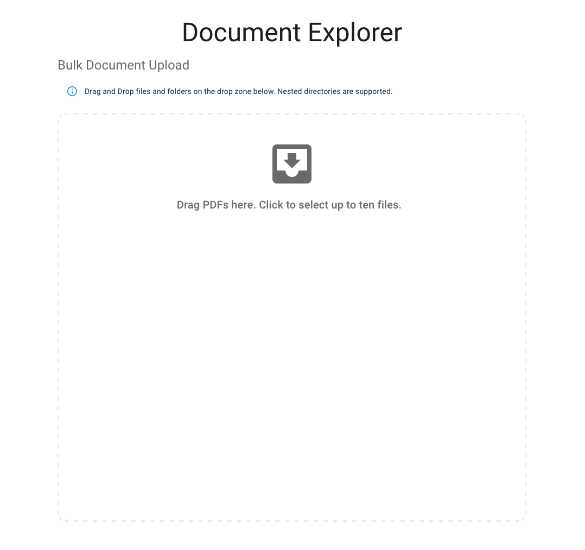
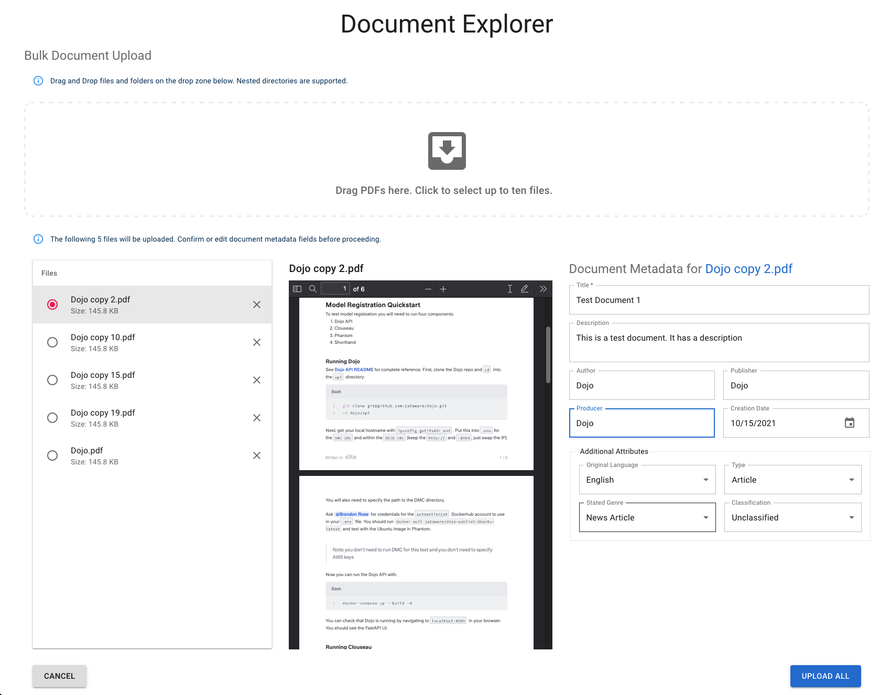
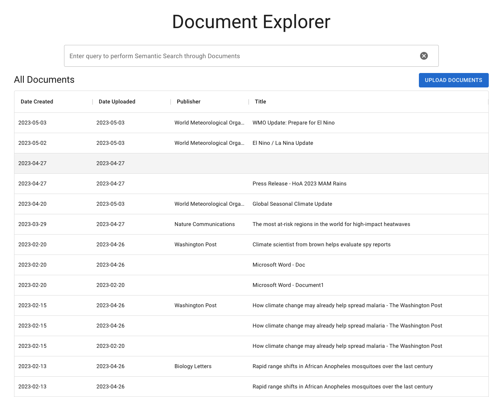
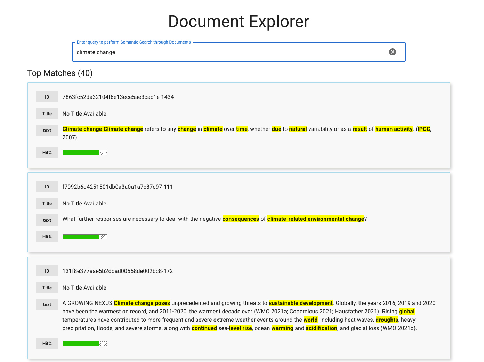

# Documents

## Document Uploader

You can access the Document Uploader by clicking the `Document Explorer` link on the Dojo home page or the `Documents` tab in the navbar from anywhere on the site, and then clicking the blue `Upload Documents` button just below the search bar on the right.

The Document Uploader allows you to upload PDFs to Dojo so that they can then be processed for future searching in the Document Explorer. It uses a simple drag and drop or file explorer interface to upload up to 10 files at a time.

Once you've selected your files, you can annotate the metadata for each of your PDFs. Dojo may infer some of the metadata from the files themselves, but you can change these generated fields as you go through your annotations.

After you're done with your annotations, click `Upload All` to complete the upload process.

## Document Explorer

The Document Explorer allows you to view all the documents in the system in a sortable table format. If you click on any row, you'll see the details of the specific document displayed as a pop up dialog. This will include whatever metadata the uploader added with their annotation.

The search bar above the table performs a semantic search, which means it attempts to understand the context and intent behind your query, rather than merely matching keywords. Consequently, when you use it, you are returned a list of results from the document database that are not just relevant but are tailored to your search criteria, providing more accurate and meaningful results. Each result is accompanied by a hit percentage, which indicates the degree of match between your query and the content of the document, offering you an additional measure of relevance.

As with the basic table before the search, if you click on any of the search results, you will see the full details of the PDF.

