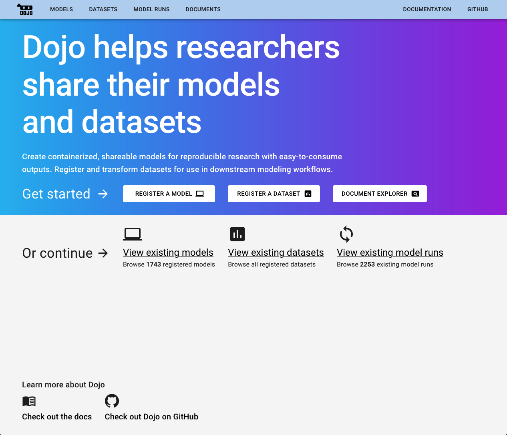
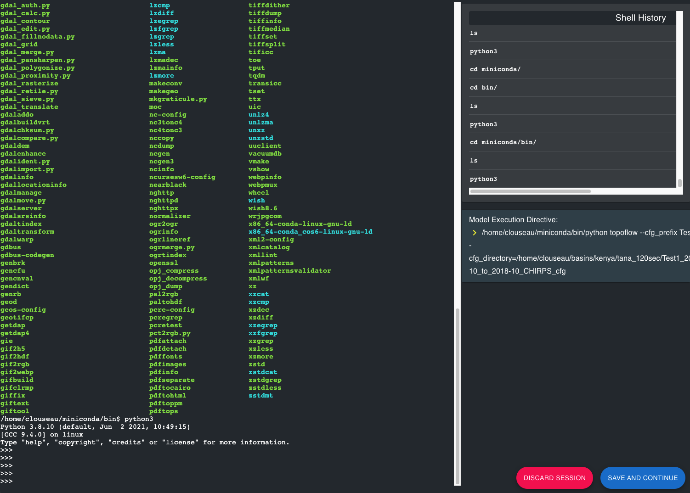
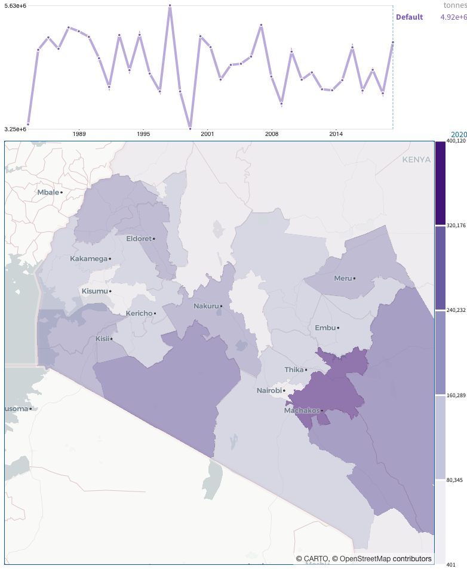

Dojo ([https://github.com/dojo-modeling](https://github.com/dojo-modeling)) is a suite of software tools that enables domain experts to do three things:

##### Register and Execute Models

Modelers can register their models using Dojo's intuitive web based terminal emulator. Models can be executed via a standardized, expressive API by wrapping heterogenous models into a consistent interface for parameterization and transforming model outputs into a consistent, easy to consume format. Dojo models facilitate reproducible research by enabling modelers to containerize and share their models with guarantees that the model will perform as they expect outside their own compute environment.

##### Register and Transform Datasets

Dojo provides a mechanism for analysts and domain experts to register and transform datasets for use in downstream modeling workflows.

##### Upload and Search Documents

Dojo also includes a document uploader and explorer, which is a means to manage an organization’s knowledge and leverage it inside index model analysis workflows. Users can upload PDFs that are relevant to their analysis in order to surface them as evidence during the creation of an index model. Dojo offers a semantic search capability over these documents which unlocks the ability to discover information across thousands of PDF documents with ease.

## Contents

1. [Model Registration](./model-registration.md)
2. [Data Registration](./data-registration.md)
3. [Model Execution](./model-execution.md)
4. [Documents](./documents)
5. [Dojo API](./dojo-api.md)

## Model Registration

The model registration workflow is designed to provide domain modelers with a friendly and familiar environment from which to install, setup, and execute their model. Throughout this process, the modeler is queried for key information about model metadata and how to parameterize the model. The modeler also annotates model outputs so that they can be automatically transformed into a ready-to-use and well understood format each time the model is executed. The final step of the model registration workflow is the publication of a working "black box" model Docker container to Dockerhub. These containers can run the model with a set of explicit directives; however the Dojo modeling engine is naive to the inner workings of the model container. 

     
     
    <i>Dojo Containerization Environment</i>

## Data Registration

 Dojo offers a powerful user-driven data normalization capability through its data registration workflow. This workflow is designed to allow analysts, modelers and other users to curate their own datasets for modeling and analysis. Dojo supports the registration of CSV, Excel File, GeoTiff or NetCDF; once registered, datasets are transformed into _indicators_ that are represented in a canonical parquet format with a well-defined structure. Typical examples of data that might be registered are indicators from the [World Bank](https://data.worldbank.org/), [FAO](http://www.fao.org/statistics/en/), or [ACLED](https://acleddata.com/), however users can bring anything they think will be useful for modeling or other analyses. 

Through this process, Dojo captures metadata about the dataset's provenance as well as descriptors for each of its features in order to transform it into a ready-to-use and well understood format. You can learn more about the data registration process [here](./data-registration.html).

Normalizing data and model outputs to a consistent Geotemporal format facilitates rapid inter-model comparison and visualization via platforms such as [Uncharted Software's](https://uncharted.software/) Causemos tool.

     
     
    <i>Uncharted's Causemos Platform</i>

## Model Execution

This section provides information on how to use Dojo's model execution CLI. This tool enables users to execute Dojo models locally via Docker.

## Documents

This tool enables users to upload and search through large numbers of PDF documents.

## Dojo API

This section provides an overview of how to interact with the Dojo API for model discovery, model execution, fetching model runs, and debugging models.