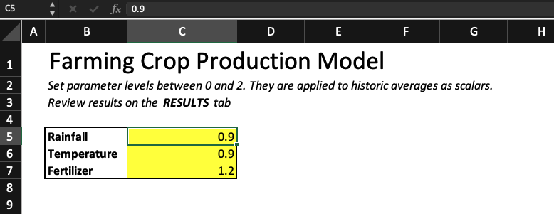

# Registering Excel Models in Dojo

To aid in running models written in Excel, Dojo has a helper tool that allows for the execution of `.xlsx` files with the ability to define dynamic parameters. Since models must be executable via the command line to be registered to Dojo, this allows modelers with Excel based models to register them into Dojo.


## Excel-Model-Runner

The **[Excel-Model-Runner](https://github.com/dojo-modeling/excel-model-runner)** is built on top of the excellent [formulas](https://github.com/vinci1it2000/formulas) library. To use it, you must identify specific cells that contain paramters for your model. These should be enumerated in either a `JSON` or `CSV` file. Once you have defined your parameters, the `Excel-Model-Runner` interprets all formulas in your Excel workbook and uses them to calculate model results. 


## How to Register an Excel Model

There are two key steps to registering an Excel model to Dojo:

1. Define your parameters in a configuration file
2. Load your model to the containerization environment and execute it

These steps are described below in more detail.

### Defining parameters

First, you must define the parameters or tunable knobs relied on by your model within your Excel workbook. Assume you have an Excel workbook with a sheet called `Parameters`:

<p align="center">
    
    <br/>
    <i>Parameters in Excel Workbook</i>
</p>

The parameter for `Rainfall` is in `C5`, the one for `Temperature` is in `C6`, and the one for `Fertilizer` is in `C7`. You should create a file called `params.json` which would contain the following:

```
{
  "Parameters.C5": "0.9",
  "Parameters.C6": "0.9",
  "Parameters.C7": "1.2"
}
```

Alternatively, you could create a CSV called `params.csv` which would contain:

```
Parameters.C5,0.9,rainfall
Parameters.C6,0.9,temperature
Parameters.C7,1.2,fertilizer
```

Either option will work. 

### Registering your model

You should proceed to register your model just like any other model in Dojo. When asked to select a starting image, you should choose the `Ubuntu-Analytics` one since the `Excel-Model-Runner` is already installed there. Alternatively, you can install it by hand from [its Github page](https://github.com/dojo-modeling/excel-model-runner).

Next, ensure that your model Excel file and your `params.json` (or `params.csv`) file are loaded into the containerization environment. You should use `dojo config params.json` to annotate your config file. Then, execute the model with something like:

```
run-excel-model my_model.xlsx params.json
```
If the above doese not work, you may need to use the following:
```
python3 /usr/local/bin/run-excel-model my_model.xlsx params.json
```

Your results will be stored to the `outputs` directory; from there you should use `dojo annotate` to annotate them per the usual model registration workflow.

> Note: if you need help getting your Excel model and parameter file into the containerization environment please reach out to dojo@jataware.com


